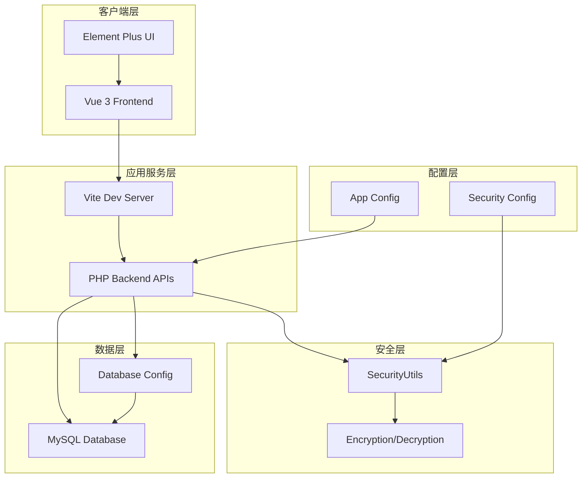
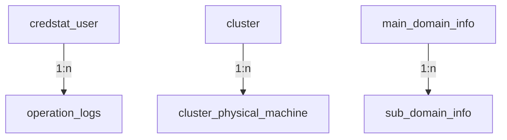
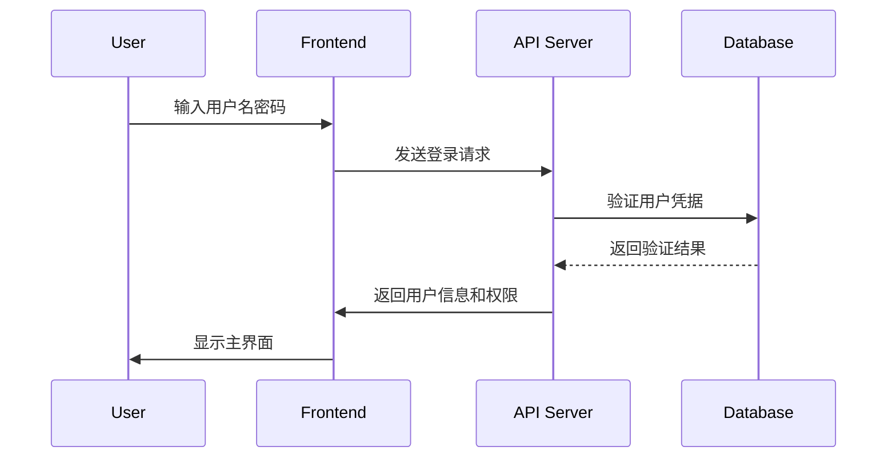
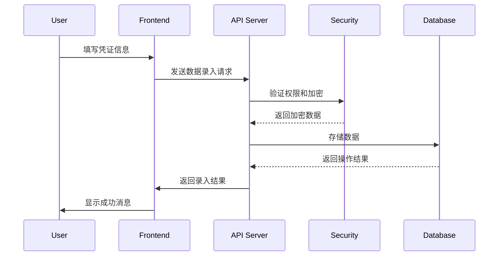
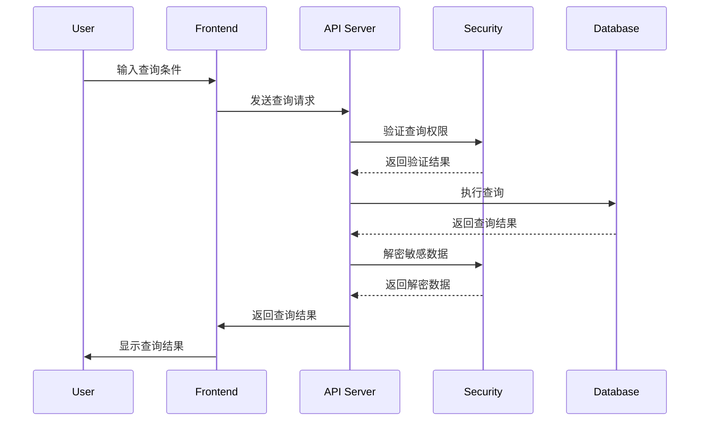

# CredStat 企业级凭证统计管理系统 - 系统设计文档

## 1. 系统概述

### 1.1 项目背景
CredStat 是一个企业级凭证统计管理系统，旨在统一管理和安全存储企业内部的各种凭证信息，包括信息系统登录信息、服务器账号密码、网络设备登录信息、宿主机集群信息等。系统采用前后端分离架构，提供安全、便捷的凭证管理解决方案。

### 1.2 系统目标
- 统一管理企业内部各类凭证信息
- 提供安全的凭证存储和访问机制
- 实现细粒度的权限控制
- 支持多类别信息的快速查询和检索
- 保证数据的完整性和安全性

### 1.3 技术架构
- **前端技术栈**: Vue 3.3.4 + TypeScript 5.2.2 + Element Plus 2.12.0
- **构建工具**: Vite 4.4.9
- **后端技术栈**: PHP 7.4+
- **数据库**: MySQL 5.7+
- **安全机制**: AES-256-CBC加密算法

## 2. 系统架构设计

### 2.1 整体架构

### 2.2 分层架构
系统采用经典的三层架构模式：
- **表现层**: Vue 3 + Element Plus，负责用户界面展示和交互
- **业务逻辑层**: PHP后端API，处理业务逻辑和数据验证
- **数据访问层**: MySQL数据库，负责数据存储和检索

## 3. 模块划分

### 3.1 用户管理模块
- **功能**: 用户注册、登录、权限分配、账户管理
- **主要组件**: 
  - LoginView.vue: 登录界面
  - UserSettingsView.vue: 用户设置和管理界面
- **API接口**: user_api.php
- **数据表**: credstat_user

### 3.2 信息录入模块
- **功能**: 各类凭证信息的录入和管理
- **主要组件**:
  - ServerCredEntryView.vue: 服务器账号密码录入
  - SwitchCredEntryView.vue: 网络设备凭证录入
  - ClusterEntryView.vue: 集群信息录入
  - PhyServerEntryView.vue: 物理服务器信息录入
  - DomainCertEntryView.vue: 域名证书信息录入
- **API接口**: save_*系列PHP文件
- **数据表**: server_cred, net_dev_cred, cluster, phy_server_info, certificate_info

### 3.3 信息查询模块
- **功能**: 多条件、多类别信息查询和检索
- **主要组件**: InfoQueryView.vue
- **API接口**: search_api.php
- **支持查询类型**: 信息系统登录信息、服务器账号密码、网络设备登录信息、宿主机集群信息

### 3.4 系统设置模块
- **功能**: 数据库配置、基础对象设置、系统参数配置
- **主要组件**:
  - DatabaseSettingsView.vue: 数据库配置界面
  - BaseObjectSettingsView.vue: 基础对象设置界面
- **API接口**: db_config_handler.php, base_obj_api.php

### 3.5 服务管理模块
- **功能**: 系统服务状态监控和管理
- **主要组件**: ServiceManagementView.vue

## 4. 数据库设计

### 4.1 数据库表结构

#### 4.1.1 用户表 (credstat_user)
| 字段名 | 类型 | 约束 | 说明 |
|--------|------|------|------|
| credstat_user_id | INT | AUTO_INCREMENT PRIMARY KEY | 主键ID |
| credstat_user_account | VARCHAR(50) | NOT NULL UNIQUE | 用户账号 |
| credstat_user_name | VARCHAR(100) | NOT NULL | 用户姓名 |
| credstat_user_password | VARCHAR(255) | NOT NULL | 加密存储的密码 |
| credstat_user_status | TINYINT(1) | DEFAULT 1 | 账号状态 |
| credstat_user_remark | TEXT | | 备注信息 |
| credstat_user_perm_add | TINYINT(1) | DEFAULT 0 | 增加权限 |
| credstat_user_perm_delete | TINYINT(1) | DEFAULT 0 | 删除权限 |
| credstat_user_perm_edit | TINYINT(1) | DEFAULT 0 | 修改权限 |
| credstat_user_perm_query | TINYINT(1) | DEFAULT 1 | 查询权限 |
| credstat_user_perm_manage | TINYINT(1) | DEFAULT 0 | 管理权限 |
| credstat_user_created_at | TIMESTAMP | DEFAULT CURRENT_TIMESTAMP | 创建时间 |
| credstat_user_updated_at | TIMESTAMP | DEFAULT CURRENT_TIMESTAMP ON UPDATE CURRENT_TIMESTAMP | 更新时间 |
| credstat_user_images_path | VARCHAR(255) | DEFAULT NULL | 头像路径 |

#### 4.1.2 登录信息表 (login_info)
| 字段名 | 类型 | 约束 | 说明 |
|--------|------|------|------|
| login_info_id | INT | AUTO_INCREMENT PRIMARY KEY | 主键ID |
| login_info_system_name | VARCHAR(100) | NOT NULL | 系统名称 |
| login_info_ip_url | VARCHAR(100) | NOT NULL | IP/URL |
| login_info_login_type | VARCHAR(50) | NOT NULL | 登录方式 |
| login_info_username | VARCHAR(50) | NOT NULL | 用户名 |
| login_info_password | VARCHAR(255) | NOT NULL | 加密存储的密码 |
| login_info_remark | TEXT | | 备注信息 |
| login_info_created_at | TIMESTAMP | DEFAULT CURRENT_TIMESTAMP | 创建时间 |
| login_info_updated_at | TIMESTAMP | DEFAULT CURRENT_TIMESTAMP ON UPDATE CURRENT_TIMESTAMP | 更新时间 |
| login_info_is_active | TINYINT(1) | DEFAULT 1 | 是否有效 |

#### 4.1.3 服务器账号密码表 (server_cred)
| 字段名 | 类型 | 约束 | 说明 |
|--------|------|------|------|
| id | INT | AUTO_INCREMENT PRIMARY KEY | 主键ID |
| server_cred_server_name | VARCHAR(100) | NOT NULL | 服务器名称 |
| server_cred_server_ip | VARCHAR(50) | NOT NULL | 服务器IP |
| server_cred_server_port | INT | NOT NULL DEFAULT 3389 | 服务器端口 |
| server_cred_server_os | VARCHAR(100) | NOT NULL | 操作系统类型 |
| server_cred_login_username | VARCHAR(100) | NOT NULL | 登录用户名 |
| server_cred_login_password | VARCHAR(255) | NOT NULL | 加密存储的密码 |
| server_cred_notes | TEXT | | 备注信息 |
| server_cred_network_area | VARCHAR(50) | DEFAULT '内网' | 网络区域 |
| server_cred_server_type | VARCHAR(50) | DEFAULT '物理机' | 服务器类型 |
| server_cred_host_cluster | VARCHAR(100) | DEFAULT '' | 所属集群 |
| created_at | TIMESTAMP | DEFAULT CURRENT_TIMESTAMP | 创建时间 |
| updated_at | TIMESTAMP | DEFAULT CURRENT_TIMESTAMP ON UPDATE CURRENT_TIMESTAMP | 更新时间 |
| is_active | TINYINT(1) | DEFAULT 1 | 是否有效 |
| server_cred_created_by | VARCHAR(100) | NOT NULL | 创建人 |

#### 4.1.4 网络设备凭证表 (net_dev_cred)
| 字段名 | 类型 | 约束 | 说明 |
|--------|------|------|------|
| id | INT | AUTO_INCREMENT PRIMARY KEY | 主键ID |
| net_dev_cred_dev_type | VARCHAR(50) | NOT NULL | 设备类型 |
| net_dev_cred_net_type | VARCHAR(50) | NOT NULL | 网络类型 |
| net_dev_cred_physical_area | VARCHAR(100) | NOT NULL | 物理区域 |
| net_dev_cred_building_floor | VARCHAR(100) | NOT NULL | 楼宇楼层 |
| net_dev_cred_floor_location | VARCHAR(100) | NOT NULL | 楼层位置 |
| net_dev_cred_chinese_name | VARCHAR(100) | NOT NULL | 中文名称 |
| net_dev_cred_system_name | VARCHAR(100) | NOT NULL | 系统名称 |
| net_dev_cred_dev_brand | VARCHAR(50) | NOT NULL | 设备品牌 |
| net_dev_cred_dev_sign | VARCHAR(100) | NOT NULL | 设备型号 |
| net_dev_cred_management_ip | VARCHAR(50) | NOT NULL | 管理IP |
| net_dev_cred_protocol | VARCHAR(20) | NOT NULL | 管理协议 |
| net_dev_cred_port | INT | NOT NULL | 端口 |
| net_dev_cred_username | VARCHAR(50) | NOT NULL | 用户名 |
| net_dev_cred_password_hash | VARCHAR(255) | NOT NULL | 加密存储的密码 |
| net_dev_cred_enable_password_hash | VARCHAR(255) | | 特权密码 |
| net_dev_cred_snmp | VARCHAR(255) | | SNMP团体字 |
| net_dev_cred_description | TEXT | | 描述信息 |
| net_dev_cred_created_by | VARCHAR(100) | | 创建人 |
| created_at | TIMESTAMP | DEFAULT CURRENT_TIMESTAMP | 创建时间 |
| updated_at | TIMESTAMP | DEFAULT CURRENT_TIMESTAMP ON UPDATE CURRENT_TIMESTAMP | 更新时间 |

#### 4.1.5 集群表 (cluster)
| 字段名 | 类型 | 约束 | 说明 |
|--------|------|------|------|
| cluster_id | INT | AUTO_INCREMENT PRIMARY KEY | 主键ID |
| cluster_name | VARCHAR(100) | NOT NULL | 集群名称 |
| cluster_address | VARCHAR(100) | NOT NULL | 集群地址 |
| cluster_username | VARCHAR(50) | NOT NULL | 集群用户名 |
| cluster_password | VARCHAR(255) | NOT NULL | 加密存储的集群密码 |
| cluster_created_at | TIMESTAMP | DEFAULT CURRENT_TIMESTAMP | 创建时间 |
| cluster_updated_at | TIMESTAMP | DEFAULT CURRENT_TIMESTAMP ON UPDATE CURRENT_TIMESTAMP | 更新时间 |

#### 4.1.6 集群物理机表 (cluster_physical_machine)
| 字段名 | 类型 | 约束 | 说明 |
|--------|------|------|------|
| cluster_pm_id | INT | AUTO_INCREMENT PRIMARY KEY | 主键ID |
| cluster_id | INT | NOT NULL | 集群ID（外键） |
| cluster_pm_name | VARCHAR(100) | NOT NULL | 物理机名称 |
| cluster_pm_ip | VARCHAR(50) | NOT NULL | 物理机IP |
| cluster_pm_username | VARCHAR(50) | NOT NULL | 物理机用户名 |
| cluster_pm_password | VARCHAR(255) | NOT NULL | 加密存储的物理机密码 |
| cluster_pm_bmc_ip | VARCHAR(50) | | BMC IP |
| cluster_pm_bmc_username | VARCHAR(50) | | BMC用户名 |
| cluster_pm_bmc_password | VARCHAR(255) | | 加密存储的BMC密码 |
| cluster_pm_created_at | TIMESTAMP | DEFAULT CURRENT_TIMESTAMP | 创建时间 |

#### 4.1.7 基础对象表 (base_obj)
| 字段名 | 类型 | 约束 | 说明 |
|--------|------|------|------|
| base_obj_id | INT | AUTO_INCREMENT PRIMARY KEY | 主键ID |
| base_obj_room | TEXT | NOT NULL | 机房/站点（JSON格式） |
| base_obj_net_device_type | TEXT | NOT NULL | 网络设备类型（JSON格式） |
| base_obj_net_device_brand | TEXT | NOT NULL | 网络设备品牌（JSON格式） |
| base_obj_net_device_model | TEXT | NOT NULL | 网络设备型号（JSON格式） |
| base_obj_server_os | TEXT | NOT NULL | 服务器操作系统（JSON格式） |
| base_obj_created_at | TIMESTAMP | DEFAULT CURRENT_TIMESTAMP | 创建时间 |
| base_obj_updated_at | TIMESTAMP | DEFAULT CURRENT_TIMESTAMP ON UPDATE CURRENT_TIMESTAMP | 更新时间 |

#### 4.1.8 证书信息表 (certificate_info)
| 字段名 | 类型 | 约束 | 说明 |
|--------|------|------|------|
| cert_id | INT | AUTO_INCREMENT PRIMARY KEY | 主键ID |
| cert_name | VARCHAR(255) | NOT NULL | 证书名称 |
| cert_type | VARCHAR(100) | NOT NULL | 证书类型 |
| cert_domain | VARCHAR(255) | NOT NULL | 域名 |
| cert_expire_date | DATE | NOT NULL | 过期日期 |
| cert_issuer | VARCHAR(255) | NOT NULL | 颁发机构 |
| cert_status | VARCHAR(20) | DEFAULT 'active' | 证书状态 |
| cert_notes | TEXT | | 备注信息 |
| created_at | TIMESTAMP | DEFAULT CURRENT_TIMESTAMP | 创建时间 |
| updated_at | TIMESTAMP | DEFAULT CURRENT_TIMESTAMP ON UPDATE CURRENT_TIMESTAMP | 更新时间 |

#### 4.1.9 主域名表 (main_domain_info)
| 字段名 | 类型 | 约束 | 说明 |
|--------|------|------|------|
| main_domain_id | INT | AUTO_INCREMENT PRIMARY KEY | 主键ID |
| main_domain_name | VARCHAR(255) | NOT NULL UNIQUE | 主域名名称 |
| main_domain_provider | VARCHAR(100) | | 域名提供商 |
| main_domain_expire_date | DATE | | 过期日期 |
| main_domain_notes | TEXT | | 备注信息 |
| created_at | TIMESTAMP | DEFAULT CURRENT_TIMESTAMP | 创建时间 |
| updated_at | TIMESTAMP | DEFAULT CURRENT_TIMESTAMP ON UPDATE CURRENT_TIMESTAMP | 更新时间 |

#### 4.1.10 子域名表 (sub_domain_info)
| 字段名 | 类型 | 约束 | 说明 |
|--------|------|------|------|
| sub_domain_id | INT | AUTO_INCREMENT PRIMARY KEY | 主键ID |
| main_domain_id | INT | NOT NULL | 主域名ID（外键） |
| sub_domain_name | VARCHAR(255) | NOT NULL | 子域名名称 |
| sub_domain_target | VARCHAR(255) | | 目标地址 |
| sub_domain_notes | TEXT | | 备注信息 |
| created_at | TIMESTAMP | DEFAULT CURRENT_TIMESTAMP | 创建时间 |
| updated_at | TIMESTAMP | DEFAULT CURRENT_TIMESTAMP ON UPDATE CURRENT_TIMESTAMP | 更新时间 |

#### 4.1.11 物理服务器信息表 (phy_server_info)
| 字段名 | 类型 | 约束 | 说明 |
|--------|------|------|------|
| phy_server_id | INT | AUTO_INCREMENT PRIMARY KEY | 主键ID |
| phy_server_name | VARCHAR(100) | NOT NULL | 服务器名称 |
| phy_server_ip | VARCHAR(50) | NOT NULL | 服务器IP |
| phy_server_brand | VARCHAR(100) | | 服务器品牌 |
| phy_server_model | VARCHAR(100) | | 服务器型号 |
| phy_server_os | VARCHAR(100) | | 操作系统 |
| phy_server_location | VARCHAR(255) | | 服务器位置 |
| phy_server_status | VARCHAR(20) | DEFAULT 'active' | 服务器状态 |
| phy_server_notes | TEXT | | 备注信息 |
| created_at | TIMESTAMP | DEFAULT CURRENT_TIMESTAMP | 创建时间 |
| updated_at | TIMESTAMP | DEFAULT CURRENT_TIMESTAMP ON UPDATE CURRENT_TIMESTAMP | 更新时间 |

#### 4.1.12 操作日志表 (operation_logs)
| 字段名 | 类型 | 约束 | 说明 |
|--------|------|------|------|
| log_id | INT | AUTO_INCREMENT PRIMARY KEY | 主键ID |
| operation_user_id | INT | NOT NULL | 操作用户ID |
| operation_type | VARCHAR(100) | NOT NULL | 操作类型 |
| operation_details | TEXT | | 操作详情 |
| operation_ip | VARCHAR(45) | | 操作IP |
| operation_created_at | TIMESTAMP | DEFAULT CURRENT_TIMESTAMP | 创建时间 |

### 4.2 表关系图

## 5. 数据流说明

### 5.1 用户认证流程

### 5.2 数据录入流程

### 5.3 数据查询流程

## 6. 关键接口描述

### 6.1 用户管理接口 (user_api.php)
- **功能**: 用户的增删改查、登录验证、权限管理
- **主要操作**:
  - list: 获取用户列表（分页）
  - add: 添加用户
  - edit: 编辑用户信息
  - delete: 删除用户
  - login: 用户登录验证
  - getCurrentUser: 获取当前用户信息
  - uploadAvatar: 上传用户头像

### 6.2 信息查询接口 (search_api.php)
- **功能**: 多类别、多关键词信息查询
- **主要特性**:
  - 支持多表联合查询
  - 支持模糊匹配
  - 支持分页和排序
  - 支持数据导出（CSV、HTML格式）
  - 支持权限验证

### 6.3 数据录入接口
- **功能**: 各类凭证信息的录入和更新
- **主要接口**:
  - save_server_cred.php: 服务器账号密码录入
  - save_dev_cred.php: 网络设备凭证录入
  - save_cluster.php: 集群信息录入
  - save_phy_server.php: 物理服务器信息录入
  - save_main_domain.php: 主域名信息录入
  - save_sub_domain.php: 子域名信息录入
  - save_login_info.php: 登录信息录入

### 6.4 基础对象接口 (base_obj_api.php)
- **功能**: 管理基础对象配置（机房、设备类型、品牌等）
- **主要操作**:
  - getBaseObject: 获取基础对象数据
  - saveBaseObject: 保存基础对象数据

## 7. 安全机制

### 7.1 数据加密
- **加密算法**: AES-256-CBC
- **加密方式**: 可逆加密，用于存储敏感信息如密码
- **密钥管理**: 在security.php配置文件中定义密钥和IV

### 7.2 权限控制
- **权限类型**: 增(add)、删(delete)、改(edit)、查(query)、管理(manage)
- **权限验证**: 在API层面进行权限验证
- **角色管理**: 通过用户权限字段控制操作权限

### 7.3 输入验证
- **前端验证**: 使用Element Plus表单验证
- **后端验证**: 对所有输入进行格式和长度验证
- **SQL注入防护**: 使用预处理语句

## 8. 系统优化建议

### 8.1 性能优化
1. **数据库优化**:
   - 为常用查询字段添加索引
   - 优化复杂查询语句
   - 实现查询结果缓存

2. **代码优化**:
   - 提取公共函数，减少代码重复
   - 优化前端组件渲染性能
   - 实现懒加载机制

### 8.2 安全增强
1. **密钥管理**:
   - 将加密密钥移至环境变量或外部密钥管理系统
   - 定期更换加密密钥

2. **权限控制**:
   - 强化权限验证机制
   - 实现更细粒度的权限控制

### 8.3 架构改进
1. **API版本控制**:
   - 实施API版本控制机制
   - 提供向后兼容性

2. **日志管理**:
   - 实现结构化日志记录
   - 添加日志轮转机制

### 8.4 可维护性提升
1. **代码质量**:
   - 统一代码风格
   - 添加详细注释
   - 实现自动化测试

2. **部署优化**:
   - 创建部署脚本
   - 实现CI/CD流程
   - 提供环境配置指南

## 9. 部署说明

### 9.1 环境要求
- **PHP**: 7.4或更高版本
- **MySQL**: 5.7或更高版本
- **Node.js**: 16或更高版本
- **Nginx/Apache**: Web服务器

### 9.2 部署步骤
1. 克隆项目代码
2. 配置数据库连接参数
3. 安装前端依赖: `npm install`
4. 构建前端: `npm run build`
5. 配置Web服务器
6. 设置安全配置参数

## 10. 总结

CredStat企业级凭证统计管理系统是一个功能完善的凭证管理平台，具备用户管理、多类别信息录入查询、安全加密存储等核心功能。系统采用了现代化的技术栈，具有良好的可扩展性和安全性。通过本文档的分析，我们识别了系统的优势和潜在问题，并提出了相应的优化建议，为系统的持续改进提供了参考依据。